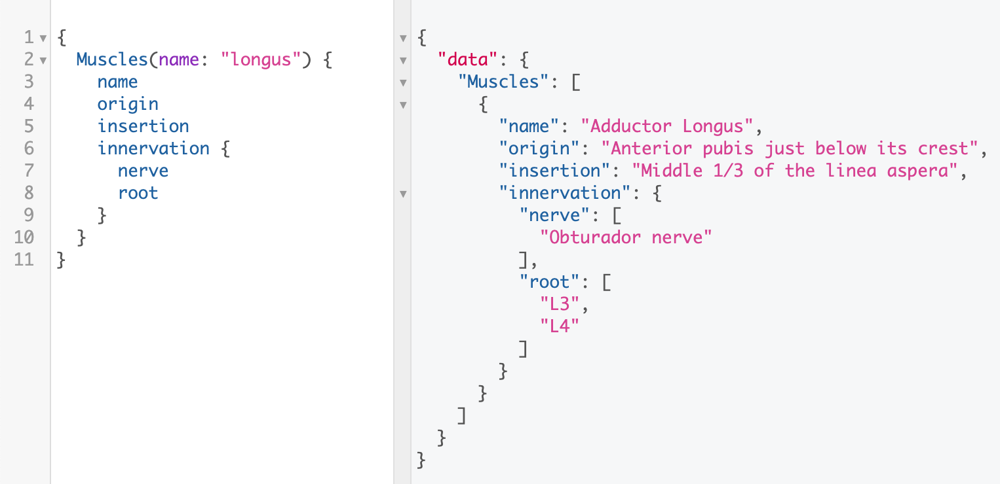
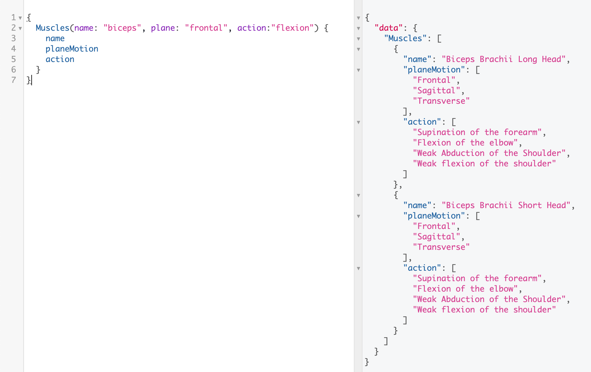
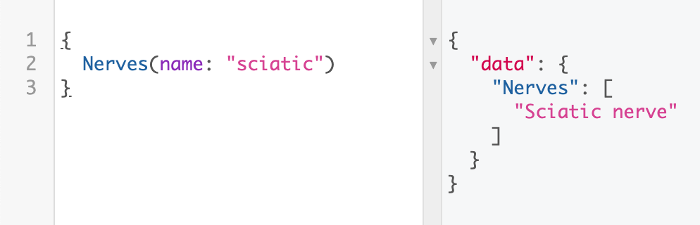
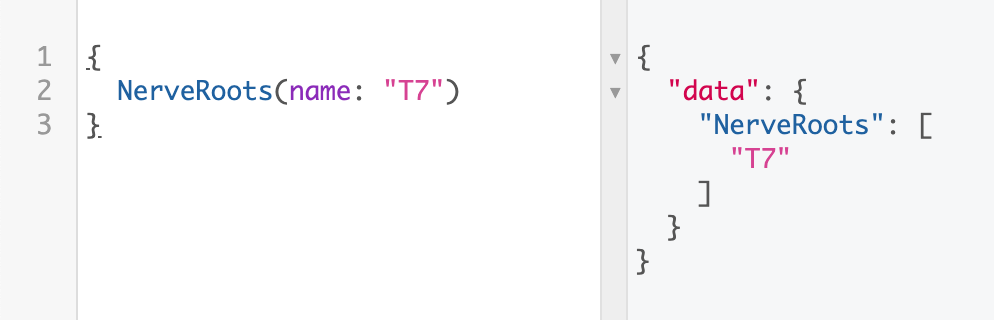
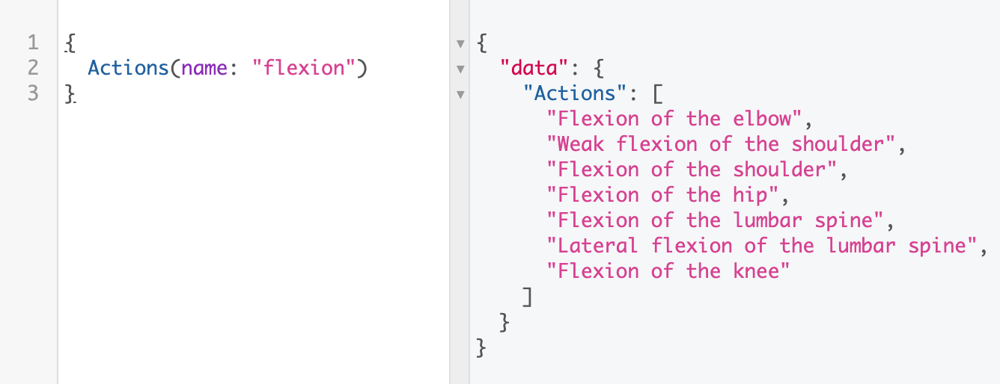
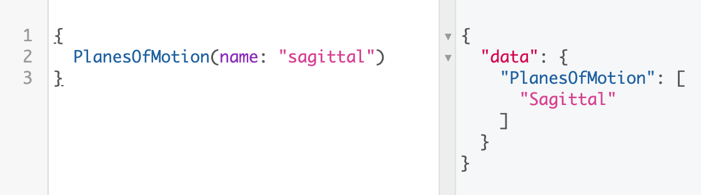

# Introducción

El propósito de _Kiness API_ es permitir a los desarrolladores tener acceso a casi todos los datos relacionados con el movimiento humano, músculos, ejercicios de fuerza, todo esto bajo el paraguas del concepto "Kinesiología".

Nuestra aspiración es crear herramientas que permitan a los desarrolladores crear su vez, nuevas apps y servicios increíbles relacionados con el campo de la Kinesiología y las Ciencias de la Actividad Física y del Deporte.

# Kiness API

**Kiness API** es una API hecha con GraphQL que proporciona a los desarrolladores todos los datos relacionados con las ciencias del movimiento humano, también conocida como Kinesiología 🤾‍♂️⛹️‍♀️.

Los datos por los que hemos empezado son los relacionados con los músculos 💪 y nervios 🧠. Datos relacionados con los huesos y otras cosas muy interesantes están de camino por llegar 🏋️‍♀️.

## Empecemos

Estas instrucciones te ayudarán a entender mejor el funcionamiento de la API y el tipo de datos que puedes consultar y obtener.

### Estructura de los datos

Las entitades de datos principales que encontrarás son:

- Músculos
- Nervios
- Raíces Nerviosas
- Acciones
- Planos de Movimiento

### Consultando datos

Para obtener la información relacionada con una entidad debes construir las consultas como la siguiente:

```graphql
# Reemplazar 'Entity' por alguna de las mencionadas anteriormente.
{
  Entity(name: "Algún texto que pueda incluir el nombre")
}
# Si quieres obtener todas las entradas de la base de datos...:
{
  Entity
}
```

Esta es la forma de obtener todas las entradas que coincidan con la entidad (músculos, nervios, etc) especificada.

Pongamos por ejemplo que quieres obtener los nombres de todos los músculos y nervios disponibles en la base de datos:

```graphql
{
  Nerves(name: "")
  Muscles(name: "") {
    name
  }
}
```

Estas dos formas, escribiendo el parámetro "name" vacío o sin pasar ningún parámetro, te dan el mismo resultado.

## Ejemplos

### Músculos

- Get muscles whose names include the specific string provided, specifying the data you want to retrieve from them (name, origin, insertion, nerve, root):

```graphql
{
  Muscles(name: "biceps") {
    name
    origin
    insertion
    nerve
    root
  }
}
```



The muscle entity is the most powerful and the one that can bring more posibilities. The parameters you can add to filter the muscles are: name, origin, insertion, nerve, root, plane of motion and action. As an example, we can find the muscle that it's being innervated by some specific nerve and does some specific action:

```graphql
{
  Muscles(name: "biceps", plane: "frontal", action: "flexion") {
    name
    planeMotion
    action
  }
}
```

Giving the next:



### Nerves

- Get nerves whose names include the specific string provided:

```graphql
{
  Nerves(name: "sciatic")
}
```



### Nerve Roots

- Get nerves' roots whose names include the specific string provided:

```graphql
{
  NerveRoots(name: "T7")
}
```



### Actions

- Get actions whose names include the specific string provided:

```graphql
{
  Actions(name: "flexion")
}
```



### Plane of Motion

- Get planes of motion whose names include the specific string provided:

```graphql
{
  PlanesOfMotion(name: "sagittal")
}
```



## Built With

- [GraphQL](https://graphql.org/) - GraphQL is a query language for APIs and a runtime for fulfilling those queries with your existing data.
- [TypeScript](http://www.typescriptlang.org/) - TypeScript is a typed superset of JavaScript that compiles to plain JavaScript.
- [Express](https://expressjs.com/) - Fast, unopinionated, minimalist web framework for Node.js.

## Contributing

Please read [CONTRIBUTING.md](#) for details on our code of conduct, and the process for submitting pull requests to us.

## Versioning

We use [SemVer](http://semver.org/) for versioning. For the versions available, see the [tags on this repository](https://github.com/AntelaBrais/KinessAPI/tags).

## Authors

- **Brais Antela** - _Initial work_ - [AntelaBrais](https://github.com/AntelaBrais)

See also the list of [contributors](https://github.com/AntelaBrais/KinessAPI/graphs/contributors) who participated in this project.

## License

This project is licensed under the MIT License - see the [LICENSE.md](LICENSE.md) file for details

## Acknowledgments

- Hat tip to anyone whose code was used
- Inspiration
- etc
