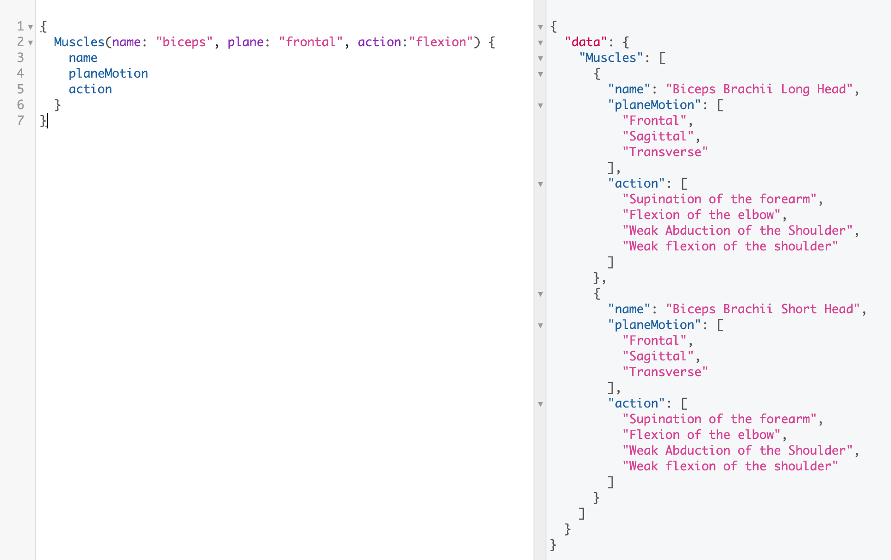
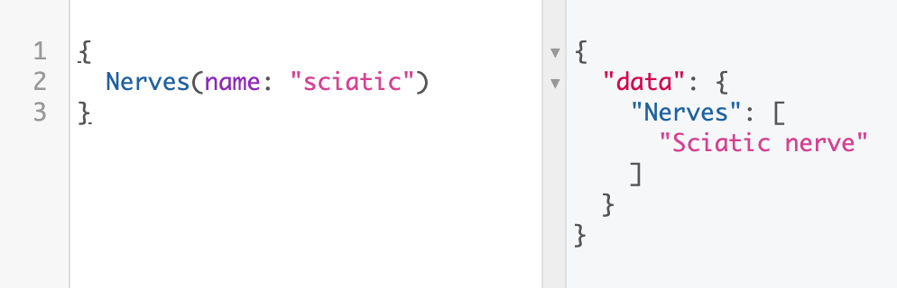

[🇪🇸 Traducción](https://github.com/AntelaBrais/KinessAPI/blob/master/README.es.md)

# Introduction

El propósito de _"Kiness API"_ es permitir a los desarrolladores tener acceso a una base de datos relacionados con el campo de la Kinesiología. Permitir a los desarrolladores crear herramientas que puedan desembocar en mejores herramientas para Kinesiólogos.

Kiness API se crea con GraphQL, un "data query language", que permite hacer consultas sobre, por ejemplo:

- Músculos: Gracias a Kiness API se podrá consultar toda la información relativa a un músculo concreto.

Imagina querer saber cuáles son los nervios que inervan el bíceps braquial, o saber en qué planos de movimiento, o su origen e insercción. Esto se podría hacer con las siguientes expresiones:

```graphql
{
  Muscles(name: "Biceps Brachii Short Head") {
    insertion
    action
  }
}
```

Con esta query obtendríamos la insercción y acción de la cabeza corta del bíceps braquial.

La clave es permitir a los desarrolladores tener herramientas (Kiness API) que les permitan crear nuevas herramientas (Ejemplo: Base de datos interactiva sobre músculos) para los Kinesiólogos.

# Kiness API

The **Kiness API** is an API made with GraphQL to bring developers all the data related with the human movement science, also known as Kinesiology 🤾‍♂️⛹️‍♀️. We are starting with muscles 💪 and nerves 🧠 data, with bones data 🦴 and other candies 🏋️‍♀️ being work in progress.

## Getting Started

These instructions will get you a copy of the project up and running on your local machine for development and testing purposes. See deployment for notes on how to deploy the project on a live system.

### Data structures

The main data entities you'll find in Kiness API are:

- Muscles
- Nerves
- Nerve Roots
- Actions
- Planes of Motion

### Querying data

To get the info related to each entity you have to build the queries as follows:

```graphql
# Replace 'Entity' by one of the mentioned previously.
{
  Entity(name: "Some text the entity could include")
}
# In case you want to get all the entries...:
{
  Entity
}
```

That's the way to retrieve all the entries that match the entity specified.

Lets say you want to get all the muscles' names and te list of nerves in the database:

```graphql
{
  Nerves(name: "")
  Muscles(name: "") {
    name
  }
}
```

These two ways, writing the parameter with an empty string or without passing any parameter, gives you all the entries.

## Examples

### Muscles

- Get muscles whose names include the specific string provided, specifying the data you want to retrieve from them (name, origin, insertion, nerve, root):

```graphql
{
  Muscles(name: "biceps") {
    name
    origin
    insertion
    nerve
    root
  }
}
```


The muscle entity is the most powerful and the one that can bring more posibilities. The parameters you can add to filter the muscles are: name, origin, insertion, nerve, root, plane of motion and action. As an example, we can find the muscle that it's being innervated by some specific nerve and does some specific action:

```graphql
{
  Muscles(name: "biceps", plane: "frontal", action: "flexion") {
    name
    planeMotion
    action
  }
}
```

Giving the next:



### Nerves

- Get nerves whose names include the specific string provided:

```graphql
{
  Nerves(name: "sciatic")
}
```



### Nerve Roots

- Get nerves' roots whose names include the specific string provided:

```graphql
{
  NerveRoots(name: "T7")
}
```


### Actions

- Get actions whose names include the specific string provided:

```graphql
{
  Actions(name: "flexion")
}
```


### Plane of Motion

- Get planes of motion whose names include the specific string provided:

```graphql
{
  PlanesOfMotion(name: "sagittal")
}
```


## Built With

- [GraphQL](https://graphql.org/) - GraphQL is a query language for APIs and a runtime for fulfilling those queries with your existing data.
- [TypeScript](http://www.typescriptlang.org/) - TypeScript is a typed superset of JavaScript that compiles to plain JavaScript.
- [Express](https://expressjs.com/) - Fast, unopinionated, minimalist web framework for Node.js.

## Contributing

Please read [CONTRIBUTING.md](#) for details on our code of conduct, and the process for submitting pull requests to us.

## Versioning

We use [SemVer](http://semver.org/) for versioning. For the versions available, see the [tags on this repository](https://github.com/AntelaBrais/KinessAPI/tags).

## Authors

- **Brais Antela** - _Initial work_ - [AntelaBrais](https://github.com/AntelaBrais)

See also the list of [contributors](https://github.com/AntelaBrais/KinessAPI/graphs/contributors) who participated in this project.

## License

This project is licensed under the MIT License - see the [LICENSE.md](LICENSE.md) file for details

## Acknowledgments

- Hat tip to anyone whose code was used
- Inspiration
