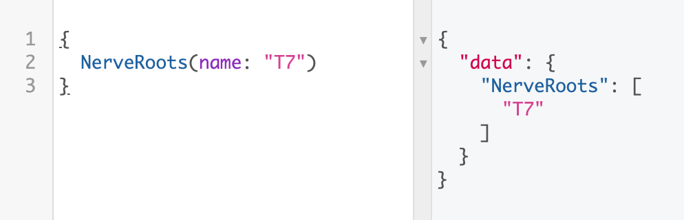

[🇪🇸 Traducción - En progreso ⚙️](https://github.com/AntelaBrais/KinessAPI/blob/master/README.es.md)

# Introduction

The purpose of _Kines API_ is to let developers have access to almost all the data related with the human movement, muscles, strength exercises, all of this is also named under the umbrella name "Kinesiology".

Our aim is to create tools for developers that let them to create new amazing apps and services in the Kinesiology and Sports sciences field.

# Kiness API

The **Kiness API** is an API made with GraphQL that brings developers all the data related with the human movement science, also known as Kinesiology 🤾‍♂️⛹️‍♀️. We are starting with muscles 💪 and nerves 🧠 data, with bones data 🦴 and other candies 🏋️‍♀️ being work in progress.

## Getting Started

These instructions will help you to better understand how the API works and the type of data you can expect to query and get.

### Data structures

The main data entities you'll find in Kiness API are:

- Muscles
- Nerves
- Nerve Roots
- Actions
- Planes of Motion

### Querying data

To get the info related to each entity you have to build the queries as follows:

```graphql
# Replace 'Entity' by one of the mentioned previously.
{
  Entity(name: "Some text the entity could include")
}
# In case you want to get all the entries...:
{
  Entity
}
```

That's the way to retrieve all the entries that match the entity specified.

Lets say you want to get all the muscles' names and te list of nerves available in the database:

```graphql
{
  Nerves(name: "")
  Muscles(name: "") {
    name
  }
}
```

These two ways, writing the parameter with an empty string or without passing any parameter, gives you all the entries.

## Examples

### Muscles

- Get muscles whose names include the specific string provided, specifying the data you want to retrieve from them (name, origin, insertion, nerve, root):

```graphql
{
  Muscles(name: "biceps") {
    name
    origin
    insertion
    nerve
    root
  }
}
```


The muscle entity is the most powerful and the one that can bring more posibilities. The parameters you can add to filter the muscles are: name, origin, insertion, nerve, root, plane of motion and action. As an example, we can find the muscle that it's being innervated by some specific nerve and does some specific action:

```graphql
{
  Muscles(name: "biceps", plane: "frontal", action: "flexion") {
    name
    planeMotion
    action
  }
}
```

Giving the next:


### Nerves

- Get nerves whose names include the specific string provided:

```graphql
{
  Nerves(name: "sciatic")
}
```


### Nerve Roots

- Get nerves' roots whose names include the specific string provided:

```graphql
{
  NerveRoots(name: "T7")
}
```



### Actions

- Get actions whose names include the specific string provided:

```graphql
{
  Actions(name: "flexion")
}
```


### Plane of Motion

- Get planes of motion whose names include the specific string provided:

```graphql
{
  PlanesOfMotion(name: "sagittal")
}
```


## Built With

- [GraphQL](https://graphql.org/) - GraphQL is a query language for APIs and a runtime for fulfilling those queries with your existing data.
- [TypeScript](http://www.typescriptlang.org/) - TypeScript is a typed superset of JavaScript that compiles to plain JavaScript.
- [Express](https://expressjs.com/) - Fast, unopinionated, minimalist web framework for Node.js.

## Contributing

Please read [CONTRIBUTING.md](#) for details on our code of conduct, and the process for submitting pull requests to us.

## Versioning

We use [SemVer](http://semver.org/) for versioning. For the versions available, see the [tags on this repository](https://github.com/AntelaBrais/KinessAPI/tags).

## Authors

- **Brais Antela** - _Initial work_ - [AntelaBrais](https://github.com/AntelaBrais)

See also the list of [contributors](https://github.com/AntelaBrais/KinessAPI/graphs/contributors) who participated in this project.

## License

This project is licensed under the MIT License - see the [LICENSE.md](LICENSE.md) file for details

## Acknowledgments

None for the moment.
